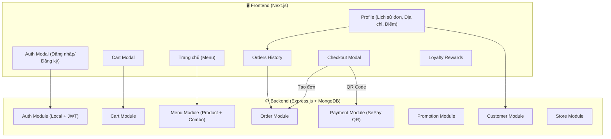
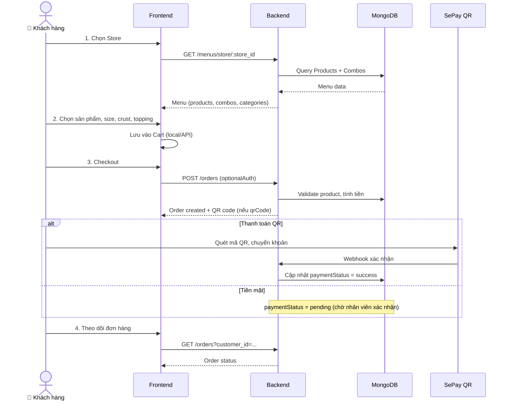
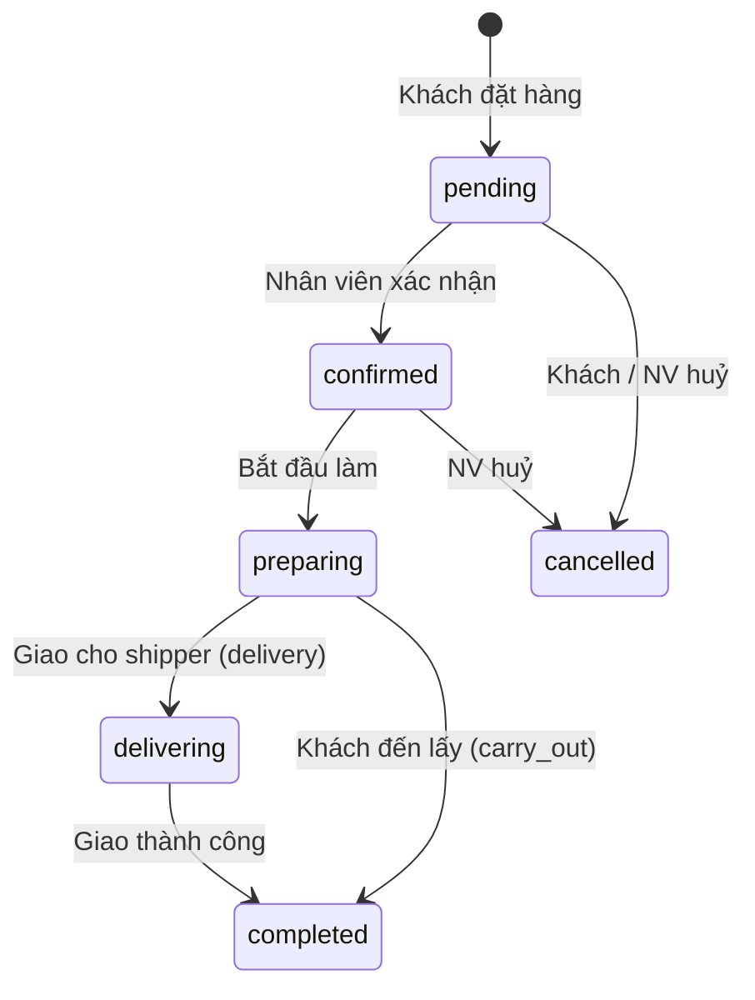
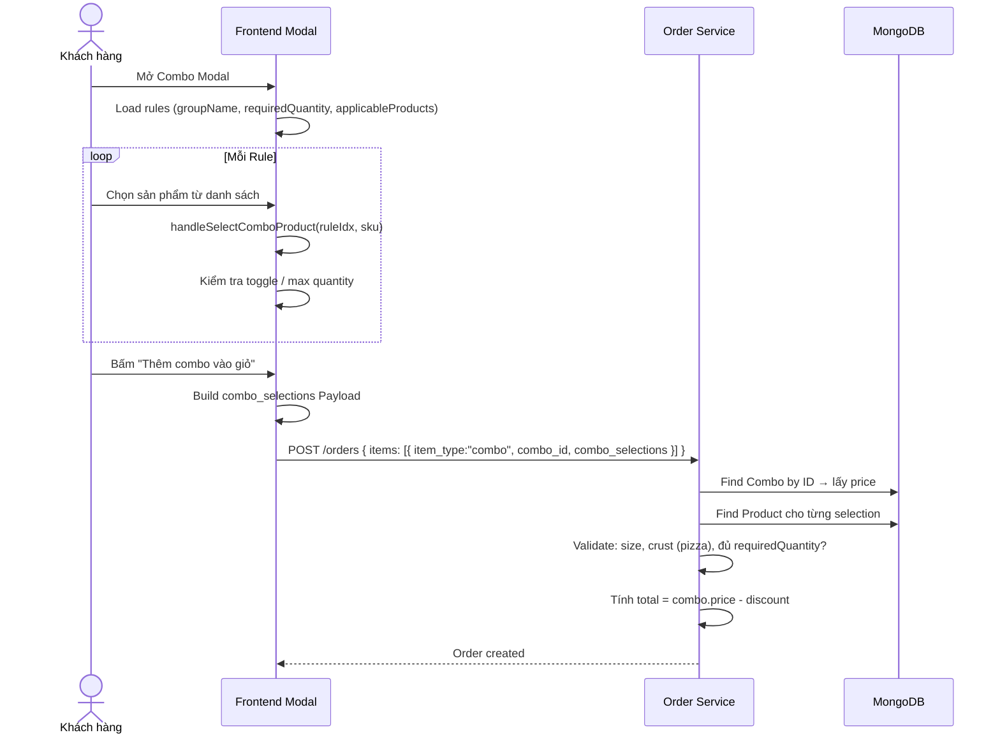

# 🍕 PaoPizza — Kịch bản Demo Hệ thống (4 Kịch bản)

> **Ngày:** 2026-07-09
> **Mục đích:** Minh họa toàn bộ quy trình: Xem Menu → Đặt hàng → Thanh toán → Xử lý đơn hàng
> **Ma trận 2×2:** Guest/Registered × Cash/QR Code

---

## Tổng quan kiến trúc hệ thống



### Ma trận 2×2 Kịch bản

```
                    Tiền mặt (Cash)           Chuyển khoản (QR Code)
               ┌─────────────────────────┬─────────────────────────┐
  Guest        │  KB1: Trần Thị B        │  KB2: Phạm Văn D        │
  (vãng lai)   │  carry_out, cash        │  delivery, qrCode       │
               │  Carbonara + Margherita │  Pepperoni + Extra      │
               ├─────────────────────────┼─────────────────────────┤
  Registered   │  KB3: Nguyễn Văn A      │  KB4: Lê Văn C          │
  (có TK)      │  delivery, cash         │  delivery, qrCode       │
               │  Custom Pizza + KM      │  Combo GĐ + KM + Huỷ    │
               └─────────────────────────┴─────────────────────────┘
```

---

### Luồng tổng quát



### Biểu đồ luồng trạng thái đơn hàng



---

## 📋 Kịch bản 1: Khách vãng lai + Tiền mặt (Guest × Cash)

> **Mục tiêu:** Minh họa luồng cơ bản nhất: không đăng nhập → chọn món → đặt mang về → trả tiền mặt tại quầy.

### Bối cảnh

- **Khách hàng:** Trần Thị B (không tài khoản, không đăng nhập)
- **Store:** PaoPizza Quận 1
- **Phương thức:** Đến lấy (carry_out) + Tiền mặt (cash)
- **Điểm nhấn:** Guest cart localStorage, không cần địa chỉ, NV thu tiền trực tiếp

### Các bước thực hiện

| #   | Bước                 | Mô tả                                             | API / Component                             | Dữ liệu mẫu                                        |
| --- | -------------------- | ------------------------------------------------- | ------------------------------------------- | -------------------------------------------------- |
| 1   | **Chọn Store**       | Lần đầu mở app → popup chọn store                 | `Header.tsx` → `showInitialStoreModal`      | Chọn "PaoPizza Quận 1"                             |
| 2   | **Tải Menu**         | Public endpoint, không cần auth                   | `GET /api/v1/menus/store/:store_id`         |                                                    |
| 3   | **Duyệt Menu**       | Tab "Tất cả" → xem toàn bộ sản phẩm               | `activeCategory = "all"`                    |                                                    |
| 4   | **Chọn Mì Ý**        | Click "Spaghetti Carbonara" → size Regular        | `hanldeProduct()` → Modal                   | `size: "Regular"`                                  |
| 5   | **Thêm giỏ (guest)** | Lưu vào `localStorage("guest_cart")`              | `cartContext.addToCart()` → nhánh `!userId` | Guest cart                                         |
| 6   | **Chọn thêm Pizza**  | "Pizza Margherita" → size M, crust Traditional    | `handleSelectSize/Crust`                    |                                                    |
| 7   | **Thêm giỏ**         | Merge vào guest cart localStorage                 |                                             | Giỏ: 1x Carbonara + 1x Margherita M/Traditional    |
| 8   | **Mở giỏ hàng**      | Bấm icon giỏ → CartModal                          | +/- quantity, xoá, sửa                      |                                                    |
| 9   | **Checkout**         | Bấm "Thanh toán"                                  | `CheckoutModal` Step 1                      |                                                    |
| 10  | **Điền thông tin**   | Chọn **Đến lấy (carry_out)** → tên + SĐT          | `orderMethod: "carry_out"`                  | `{ full_name: "Trần Thị B", phone: "0912345678" }` |
| 11  | **Bỏ qua địa chỉ**   | carry_out không cần address                       | FE tự ẩn field                              |                                                    |
| 12  | **Ghi chú**          | "Cho thêm ớt bột"                                 |                                             |                                                    |
| 13  | **Thanh toán**       | Chọn **Tiền mặt**                                 | `paymentMethod: "cash"`                     |                                                    |
| 14  | **Tạo đơn**          | `POST /api/v1/orders` (optionalAuth, không token) | `customer_id = null`                        | Order status: `pending`                            |
| 15  | **Cash → Success**   | Frontend skip QR, hiện màn success ngay           | `setCheckoutStep("success")`                | "Đến cửa hàng nhận đơn trong 20-30 phút"           |
| 16  | **NV xác nhận**      | Nhân viên thấy đơn → confirm                      | `PATCH /api/v1/orders/:id/status` (staff)   | `{ status: "confirmed" }`                          |
| 17  | **NV thu tiền**      | Khách đưa tiền → NV đánh dấu đã TT                | `PATCH /api/v1/orders/:id/payment-status`   | `{ paymentStatus: "success" }`                     |
| 18  | **Hoàn thành**       | Khách nhận hàng → completed                       | `PATCH /api/v1/orders/:id/status`           | `{ status: "completed" }`                          |

---

## 📋 Kịch bản 2: Khách vãng lai + Chuyển khoản (Guest × QR Code)

> **Mục tiêu:** Minh họa luồng khách không đăng nhập nhưng thanh toán qua QR chuyển khoản ngân hàng.

### Bối cảnh

- **Khách hàng:** Phạm Văn D (không tài khoản, không đăng nhập)
- **Store:** PaoPizza Quận 8
- **Phương thức:** Giao hàng (delivery) + QR Code (qrCode)
- **Điểm nhấn:** Guest vẫn tạo được đơn QR, polling check trạng thái, phải nhập địa chỉ giao hàng

### Các bước thực hiện

| #   | Bước                  | Mô tả                                                     | API / Component                                       | Dữ liệu mẫu                                                                       |
| --- | --------------------- | --------------------------------------------------------- | ----------------------------------------------------- | --------------------------------------------------------------------------------- |
| 1   | **Chọn Store**        | Chọn "PaoPizza Quận 8"                                    | `localStorage.setItem("selected_store")`              |                                                                                   |
| 2   | **Tải Menu**          | Public endpoint                                           | `GET /api/v1/menus/store/:store_id`                   |                                                                                   |
| 3   | **Duyệt Menu**        | Tab "Pizza" → xem danh sách pizza                         |                                                       |                                                                                   |
| 4   | **Chọn Pizza**        | "Pizza Pepperoni" → size **L**, crust **Thick**           | `handleSelectSize("L")`, `handleSelectCrust("thick")` |                                                                                   |
| 5   | **Extra Topping**     | Thêm **Phô mai Mozzarella (+15k)**, **Nấm (+10k)**        | `handleToggleExtraTopping()`                          | 2 extra toppings                                                                  |
| 6   | **Ghi chú**           | "Cắt 8 miếng, không hành"                                 |                                                       |                                                                                   |
| 7   | **Thêm giỏ (guest)**  | Lưu guest cart localStorage                               |                                                       | Giỏ: 1x Pepperoni L/Thick + 2 toppings                                            |
| 8   | **Mở giỏ hàng**       | Xem lại → bấm Thanh toán                                  |                                                       |                                                                                   |
| 9   | **Điền thông tin**    | Chọn **Giao hàng (delivery)** → tên, SĐT, địa chỉ         | `orderMethod: "delivery"`                             | `{ full_name: "Phạm Văn D", phone: "0905123456", address: "12 Nguyễn Huệ, Q.1" }` |
| 10  | **Thanh toán**        | Chọn **QR Code (Chuyển khoản)**                           | `paymentMethod: "qrCode"`                             |                                                                                   |
| 11  | **Tạo đơn**           | `POST /api/v1/orders` (optionalAuth, không token)         | `customer_id = null`                                  | Backend tạo QR SePay                                                              |
| 12  | **Hiển thị QR**       | QR code + countdown 3 phút + polling 3s                   | `CheckoutModal` → polling                             |                                                                                   |
| 13  | **Khách quét QR**     | Mở app banking → quét → chuyển đúng ST + nội dung `DH...` | SePay webhook                                         |                                                                                   |
| 14  | **Polling success**   | Frontend nhận `paymentStatus = "success"`                 | `GET /api/v1/payments/status/:order_id`               | Chuyển màn success                                                                |
| 15  | **Không xem được LS** | Guest không có `customer_id` → không xem lịch sử đơn      | —                                                     | Phải lưu mã đơn để tra cứu sau                                                    |

### So sánh Guest × Payment

| Khía cạnh       | Guest + Cash (KB1)           | Guest + QR (KB2)             |
| --------------- | ---------------------------- | ---------------------------- |
| **Tạo đơn**     | `POST /orders` (không token) | `POST /orders` (không token) |
| **Sau tạo đơn** | Hiện success ngay            | Chờ QR / polling             |
| **Nhân viên**   | Phải xác nhận + thu tiền     | Không cần (tự động)          |
| **Địa chỉ**     | Có thể bỏ qua (carry_out)    | Bắt buộc (delivery)          |
| **Lịch sử đơn** | Không xem được               | Không xem được               |

---

## 📋 Kịch bản 3: Khách đăng nhập + Tiền mặt (Registered × Cash)

> **Mục tiêu:** Minh họa luồng khách có tài khoản, đăng nhập, đặt hàng giao tận nơi, thanh toán tiền mặt khi nhận hàng.

### Bối cảnh

- **Khách hàng:** Nguyễn Văn A (hạng **GOLD**, 650 điểm tích lũy)
- **Store:** PaoPizza Quận 8
- **Phương thức:** Giao hàng (delivery) + Tiền mặt (cash)
- **Điểm nhấn:** Đăng nhập, dùng địa chỉ có sẵn, áp mã KM WELCOME10, tích điểm loyalty

### Các bước thực hiện

| #   | Bước                       | Mô tả                                                   | API / Component                           | Dữ liệu mẫu                                        |
| --- | -------------------------- | ------------------------------------------------------- | ----------------------------------------- | -------------------------------------------------- |
| 1   | **Đăng nhập**              | Bấm Đăng nhập → SĐT + mật khẩu                          | `POST /api/v1/auth/CustomerLogin`         | `{ username: "0901234567", password: "12345678" }` |
| 2   | **Lấy profile**            | JWT → `/users/me` → tier, điểm, địa chỉ                 | `GET /api/v1/users/me`                    | `{ tier: "gold", currentPoint: 650 }`              |
| 3   | **Tải Menu**               | Menu store Quận 8                                       | `GET /api/v1/menus/store/:store_id`       |                                                    |
| 4   | **Chọn Pizza**             | "Pizza Hải Sản" → size **L**, crust **Thin**            | `hanldeProduct()`                         |                                                    |
| 5   | **Extra Topping**          | Thêm **Pepperoni (+12k)**                               | `handleToggleExtraTopping()`              |                                                    |
| 6   | **Ghi chú**                | "Nhiều sốt, ít phô mai"                                 |                                           |                                                    |
| 7   | **Thêm giỏ (server)**      | Cart lưu MongoDB                                        | `POST /api/v1/cart`                       | Có sync cross-device                               |
| 8   | **Mở giỏ hàng**            | Cart lấy từ server                                      | `GET /api/v1/cart/:userId`                |                                                    |
| 9   | **Checkout**               | Bấm Thanh toán                                          |                                           |                                                    |
| 10  | **Điền thông tin**         | Chọn **Giao hàng**, tên/SĐT tự fill từ profile          | `orderMethod: "delivery"`                 |                                                    |
| 11  | **Áp mã KM**               | Nhập `WELCOME10` → kiểm tra                             | `POST /api/v1/promotions/apply`           | Giảm 10%                                           |
| 12  | **Thanh toán**             | Chọn **Tiền mặt**                                       | `paymentMethod: "cash"`                   |                                                    |
| 13  | **Tạo đơn**                | `POST /api/v1/orders` (có JWT → auto gán `customer_id`) | Backend: validate + tính total - discount | `{ status: "pending", total: ... }`                |
| 14  | **Cash → Success**         | Frontend skip QR, hiện màn success                      | "Đơn hàng sẽ được giao trong 30-45 phút"  |                                                    |
| 15  | **Xem lịch sử**            | Profile → Orders → thấy đơn với badge status            | `GET /api/v1/orders?customer_id=...`      |                                                    |
| 16  | **NV giao hàng**           | NV cập nhật status: confirmed → preparing → delivering  | `PATCH /api/v1/orders/:id/status` (staff) |                                                    |
| 17  | **NV thu tiền**            | Khách trả tiền mặt khi nhận → NV đánh dấu đã TT         | `PATCH /api/v1/orders/:id/payment-status` | `{ paymentStatus: "success" }`                     |
| 18  | **Hoàn thành + Tích điểm** | completed → backend cộng loyalty point                  |                                           | `currentPoint: 650 → ~850`                         |

---

## 📋 Kịch bản 4: Khách đăng nhập + Chuyển khoản (Registered × QR Code)

> **Mục tiêu:** Minh họa luồng phức tạp nhất: đăng nhập → chọn COMBO → áp KM thành viên → thanh toán QR → huỷ khi hết hạn → đặt lại thành công.

### Bối cảnh

- **Khách hàng:** Lê Văn C (hạng **SILVER**, 320 điểm)
- **Store:** PaoPizza Quận 8
- **Phương thức:** Giao hàng (delivery) + QR Code (qrCode)
- **Điểm nhấn:** Combo Gia Đình (2 Pizza + 2 Đồ uống), mã SILVER5, huỷ đơn + đặt lại, tích điểm

### Các bước thực hiện

| #   | Bước                     | Mô tả                                                             | API / Component                                  | Dữ liệu mẫu                                         |
| --- | ------------------------ | ----------------------------------------------------------------- | ------------------------------------------------ | --------------------------------------------------- |
| 1   | **Đăng nhập**            | Lê Văn C đăng nhập                                                | `POST /api/v1/auth/CustomerLogin`                | `{ username: "0909876543", password: "12345678" }`  |
| 2   | **Tải Menu**             | Menu store Quận 8                                                 | `GET /api/v1/menus/store/:store_id`              |                                                     |
| 3   | **Xem Combo**            | Tab "Tất cả" → section "Combo Ưu Đãi"                             | Combo Gia Đình: 2 Pizza + 2 Đồ uống, -20%        | `{ price: 350000, originalPrice: 437500 }`          |
| 4   | **Mở Combo Modal**       | Click "Combo Gia Đình"                                            | `handleOpenCombo(combo)`                         |                                                     |
| 5   | **Rule 1: Pizza (x2)**   | Chọn Pepperoni L/Thick + Hải Sản M/Thin                           | `handleSelectComboProduct(0, sku)` ×2            |                                                     |
| 6   | **Đổi crust**            | SlotCard: Pepperoni → crust Thick                                 | `handleChangeComboVariant()`                     |                                                     |
| 7   | **Rule 2: Đồ uống (x2)** | Chọn Coca-Cola + Pepsi                                            | `handleSelectComboProduct(1, sku)` ×2            |                                                     |
| 8   | **Kiểm tra đủ**          | `allComboSelectionsFilled = true`                                 | Nút sáng: "Thêm combo vào giỏ - 350.000đ"        |                                                     |
| 9   | **Thêm combo**           | `handleAddComboToCart()` → gửi `combo_selections[]`               |                                                  |                                                     |
| 10  | **Xem giỏ**              | Giá gốc 437.5k, còn 350k (tiết kiệm 87.5k)                        | `CartModal`                                      |                                                     |
| 11  | **Checkout**             | Chọn Giao hàng, điền thông tin                                    | `orderMethod: "delivery"`                        |                                                     |
| 12  | **Áp mã KM**             | Nhập `SILVER5` → giảm thêm 5%                                     | `POST /api/v1/promotions/apply`                  |                                                     |
| 13  | **Thanh toán**           | Chọn **QR Code**                                                  | `paymentMethod: "qrCode"`                        |                                                     |
| 14  | **Tạo đơn**              | `POST /api/v1/orders` (JWT + `promotion_code: "SILVER5"`)         | Backend validate combo_selections                |                                                     |
| 15  | **Tạo QR**               | SePay QR + countdown 3 phút + polling                             |                                                  |                                                     |
| 16  | **💥 KHÔNG thanh toán**  | Hết 3 phút → QR hết hạn                                           |                                                  |                                                     |
| 17  | **Huỷ đơn**              | Orders → tìm đơn pending → "Huỷ đơn hàng"                         | `PATCH /api/v1/orders/customer/cancel/:id` (JWT) | Backend check: `customer_id` khớp, status = pending |
| 18  | **Xác nhận huỷ**         | Modal confirm → Yes                                               | Status → `cancelled`, paymentStatus → `failed`   |                                                     |
| 19  | **Đặt lại**              | Bấm "Đặt lại đơn này" → copy items vào cart                       | (tính năng tương lai)                            |                                                     |
| 20  | **Đặt lại lần 2**        | Làm lại checkout, lần này quét QR thành công                      | `paymentStatus → "success"`                      |                                                     |
| 21  | **Theo dõi**             | Orders → pending → confirmed → preparing → delivering → completed | Real-time refresh                                |                                                     |
| 22  | **Tích điểm**            | Sau completed: +~350 điểm loyalty                                 | `currentPoint: 320 → ~670`                       |                                                     |

### Sub-flow: Combo Selection Logic



---

## 📊 Tổng hợp API sử dụng trong 4 kịch bản

| #   | Endpoint                             | Method | Auth         | KB1 | KB2 | KB3 | KB4 |
| --- | ------------------------------------ | ------ | ------------ | --- | --- | --- | --- |
| 1   | `/api/v1/auth/CustomerLogin`         | POST   | Public       |     |     | ✅  | ✅  |
| 2   | `/api/v1/users/me`                   | GET    | JWT          |     |     | ✅  | ✅  |
| 3   | `/api/v1/menus/store/:store_id`      | GET    | Public       | ✅  | ✅  | ✅  | ✅  |
| 4   | `/api/v1/categories`                 | GET    | Public       | ✅  | ✅  | ✅  | ✅  |
| 5   | `/api/v1/ingredient`                 | GET    | Public       |     | ✅  | ✅  |     |
| 6   | `/api/v1/stores`                     | GET    | Public       | ✅  | ✅  | ✅  | ✅  |
| 7   | `/api/v1/cart/:userId`               | GET    | Public       |     |     | ✅  | ✅  |
| 8   | `/api/v1/cart`                       | POST   | Public       | ✅  | ✅  | ✅  | ✅  |
| 9   | `/api/v1/cart/remove`                | POST   | Public       | ✅  | ✅  | ✅  | ✅  |
| 10  | `/api/v1/cart/update`                | POST   | Public       | ✅  | ✅  | ✅  | ✅  |
| 11  | `/api/v1/promotions/apply`           | POST   | Public       |     |     | ✅  | ✅  |
| 12  | `/api/v1/orders`                     | POST   | optionalAuth | ✅  | ✅  | ✅  | ✅  |
| 13  | `/api/v1/orders?customer_id=...`     | GET    | JWT          |     |     | ✅  | ✅  |
| 14  | `/api/v1/orders/customer/cancel/:id` | PATCH  | JWT          |     |     |     | ✅  |
| 15  | `/api/v1/payments/status/:order_id`  | GET    | Public       |     | ✅  |     | ✅  |
| 16  | `/api/v1/orders/:id/status`          | PATCH  | Staff        | ✅  |     | ✅  |     |
| 17  | `/api/v1/orders/:id/payment-status`  | PATCH  | Staff        | ✅  |     | ✅  |     |
| 18  | `/api/v1/customers/list-address`     | POST   | JWT          |     |     | ✅  | ✅  |

---

## 📊 So sánh 4 Kịch bản

| Khía cạnh        | KB1 (Guest+Cash)         | KB2 (Guest+QR)     | KB3 (Reg+Cash)       | KB4 (Reg+QR)      |
| ---------------- | ------------------------ | ------------------ | -------------------- | ----------------- |
| **Đăng nhập**    | ❌                       | ❌                 | ✅ (0901234567)      | ✅ (0909876543)   |
| **Giỏ hàng**     | localStorage             | localStorage       | MongoDB              | MongoDB           |
| **Tạo đơn**      | optionalAuth, null       | optionalAuth, null | optionalAuth, JWT    | optionalAuth, JWT |
| **customer_id**  | null                     | null               | auto từ token        | auto từ token     |
| **Thanh toán**   | Tiền mặt                 | QR Code            | Tiền mặt             | QR Code           |
| **Sau đặt hàng** | Success ngay             | QR + Polling       | Success ngay         | QR + Polling      |
| **NV can thiệp** | ✅ (xác nhận + thu tiền) | ❌ (tự động)       | ✅ (giao + thu tiền) | ❌ (tự động)      |
| **Xem lịch sử**  | ❌                       | ❌                 | ✅                   | ✅                |
| **Tích điểm**    | ❌                       | ❌                 | ✅                   | ✅                |
| **Khuyến mãi**   | ❌                       | ❌                 | ✅ (WELCOME10)       | ✅ (SILVER5)      |
| **Combo**        | ❌                       | ❌                 | ❌                   | ✅ (Gia Đình)     |
| **Huỷ đơn**      | ❌ (gọi NV)              | ❌ (gọi NV)        | ✅ (tự huỷ)          | ✅ (tự huỷ)       |
| **Order type**   | carry_out                | delivery           | delivery             | delivery          |

---

## 🔑 Các điểm chính cần thể hiện

### 1. Hệ thống Menu động

- Menu load theo **Store** (mỗi store có menu riêng)
- Products phân loại theo **Category** (Pizza, Mì Ý, Salad, Đồ uống...)
- **Combo** là tập hợp rules (chọn N sản phẩm từ danh mục X)
- Mỗi Product có nhiều **Variant** (size, crust, price, recipe)

### 2. Quy trình Cart thông minh

- **Guest**: Cart lưu localStorage
- **Registered**: Cart lưu MongoDB, đồng bộ cross-device
- Edit mode: bấm "Sửa" trong cart → mở lại modal với thông tin cũ
- Combo edit: mở Combo Modal với selections đã chọn trước đó

### 3. Quy trình Order & Payment

- **optionalAuth**: Cho phép cả guest và registered tạo đơn
- **Payment kép**: Cash (nhân viên xác nhận) vs QR Code (tự động qua SePay)
- **Polling**: Frontend poll `/payments/status/:order_id` mỗi 3s để check QR thành công
- **Inventory sync**: Khi tạo order, backend trừ ingredient tồn kho (nếu có recipe)

### 4. Phân quyền Order Status

| Role              | Được phép                                          |
| ----------------- | -------------------------------------------------- |
| **Customer**      | Tạo đơn, xem lịch sử, huỷ đơn (khi pending)        |
| **Staff/Manager** | Xác nhận, cập nhật trạng thái, cập nhật thanh toán |
| **Admin**         | Xoá đơn, tất cả quyền                              |

### 5. Loyalty & Promotion

- Tích điểm sau khi đơn **completed**
- Hạng thành viên: Member → Silver → Gold → Diamond
- Mã khuyến mãi validate theo: thời gian, store, hạng, số lần dùng

---

## 🎬 Cách chạy demo

### Chuẩn bị môi trường

```bash
# Backend
cd be-paopizza
npm install
npm run seed:sample    # Seed dữ liệu mẫu (stores, products, combos, etc.)
npm run seed:demo      # Seed dữ liệu demo cho 4 kịch bản (THÊM MỚI, không xoá)
npm run dev            # Chạy trên port 4000

# Frontend
cd fe-paopizza
npm install
npm run dev            # Chạy trên port 3000
```

### Trình tự demo đề xuất (từ đơn giản → phức tạp)

1. **KB1 (Guest + Cash)** — carry_out, 2 món, ~5 phút
2. **KB2 (Guest + QR)** — delivery, custom pizza + topping, QR, ~7 phút
3. **KB3 (Reg + Cash)** — login, KM WELCOME10, delivery, cash, ~8 phút
4. **KB4 (Reg + QR)** — login, COMBO, SILVER5, huỷ, đặt lại, QR, ~12 phút

### Mock SePay (nếu không có tài khoản thật)

- Dùng Postman: `PATCH /api/v1/orders/:id/payment-status` với `{ paymentStatus: "success" }`
- Frontend polling sẽ nhận status success và chuyển màn hình

### Seed dữ liệu demo

File: `src/seeds/demo-scenarios.seed.js` — chạy bằng `npm run seed:demo`

Chỉ **THÊM MỚI** (không xoá dữ liệu cũ):

| Dữ liệu               | KB1           | KB2            | KB3                 | KB4                   |
| --------------------- | ------------- | -------------- | ------------------- | --------------------- |
| **Customer**          | ❌            | ❌             | ✅ GOLD, 650đ       | ✅ SILVER, 320đ       |
| **User**              | ❌            | ❌             | ✅ `0901234567`     | ✅ `0909876543`       |
| **Cart**              | ❌            | ❌             | ✅ 1 item           | ❌                    |
| **Order (completed)** | ✅ Cash/Carry | —              | ✅ Cash/Delivery+KM | ✅ QR/Combo đặt lại   |
| **Order (pending)**   | ✅ Cash/Carry | ✅ QR/Delivery | —                   | —                     |
| **Order (cancelled)** | —             | —              | —                   | ✅ QR/Combo hết hạn   |
| **Combo**             | —             | —              | —                   | ✅ Combo Gia Đình     |
| **Promotion**         | —             | —              | ✅ WELCOME10        | ✅ SILVER5, WELCOME10 |
| **Menu**              | ✅ Store Q1   | ✅ Store Q8    | ✅ Store Q8         | ✅ Store Q8           |

### 🔑 Tài khoản demo

| Vai trò      | SĐT          | Mật khẩu   | Hạng   |
| ------------ | ------------ | ---------- | ------ |
| Nguyễn Văn A | `0901234567` | `12345678` | GOLD   |
| Lê Văn C     | `0909876543` | `12345678` | SILVER |
| Trần Thị B   | Guest        | —          | —      |
| Phạm Văn D   | Guest        | —          | —      |

---

_Tài liệu được xây dựng dựa trên phân tích toàn bộ source code backend (Express.js/MongoDB) và frontend (Next.js) của hệ thống PaoPizza — 2026-07-09._
